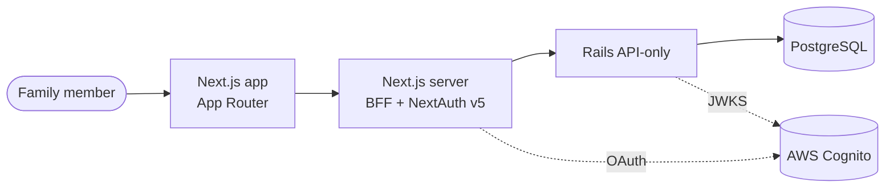
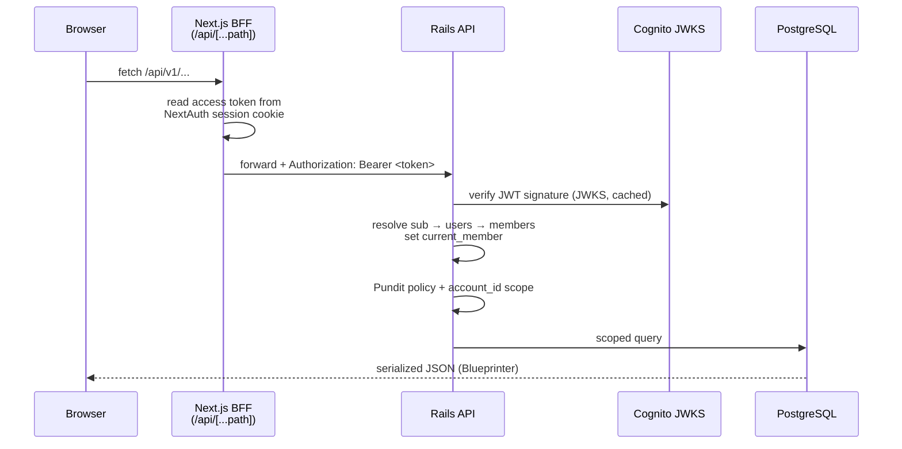
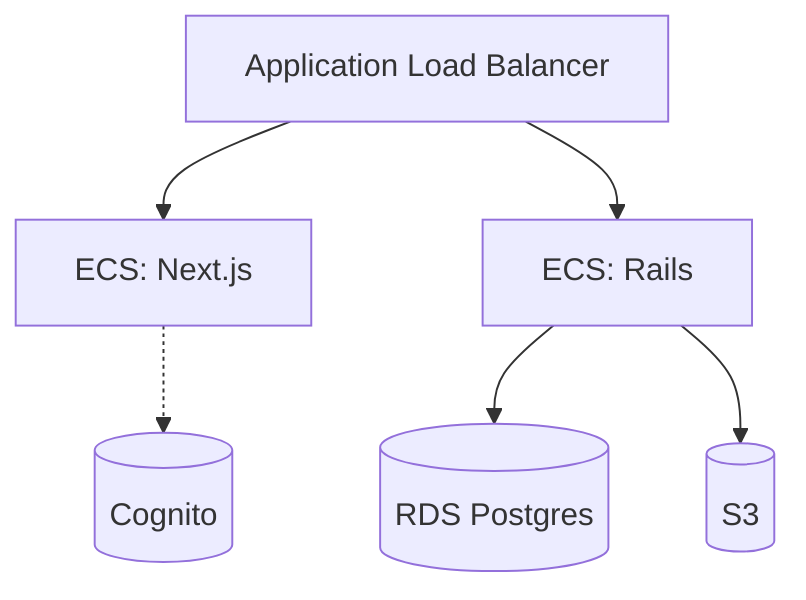

# MyPal — System Architecture

| | |
|---|---|
| **File** | `docs/architecture.md` |
| **Purpose** | The single orientation map for how MyPal is built end to end — components, the request flow, auth, data, and deployment. When you ask "how does a request actually get from the browser to the database?", this is the first place to look. For *why* a decision was made, follow the link to the relevant ADR in `docs/adrs.md`. |
| **Version** | 1.0 |
| **Updated by** | [name] |
| **Last updated** | [DD/MM/YYYY HH:MM UTC] |

**Maintaining this file.** Every edit must: (1) bump the **Version** (patch for wording, minor for a new section or diagram, major for a structural rewrite), (2) update **Last updated** to the current UTC time (`date -u +"%d/%m/%Y %H:%M UTC"` — never guess), (3) set **Updated by**, (4) append a row to the Revision history table at the bottom. The header and the latest revision-history row must always agree. This document **describes the target design** and marks anything not yet built with _(not yet built)_ so the gap is explicit rather than silent. It never contradicts an ADR — if the design changes, change the ADR first (via `/tech_architecture`), then reflect it here.

> **Diagram convention.** Every diagram appears **twice**: a Mermaid fenced block (renders on GitHub) immediately followed by an equivalent ASCII diagram in a plain fenced code block (renders in any editor without an extension). Keep the two in sync on every edit.

---

## 1. System context

[2–4 sentences: what MyPal is, the top-level tenancy model (account → members → users), and the three big moving parts — Next.js frontend + BFF, Rails API, Postgres — plus AWS. Link the multi-tenancy decision to ADR-001.]



```text
 Family member
      │
      ▼
 ┌─────────────┐  /api/*   ┌──────────────────┐  Bearer JWT  ┌──────────────┐     ┌────────────┐
 │   Browser   │ ────────▶ │  Next.js server  │ ───────────▶ │  Rails API   │ ──▶ │ PostgreSQL │
 │ (App Router)│           │  BFF + NextAuth  │              │  (API-only)  │     └────────────┘
 └─────────────┘           └────────┬─────────┘              └──────┬───────┘
                                    │ OAuth                         │ JWKS
                                    ▼                               ▼
                            ┌───────────────────────────────────────────┐
                            │                AWS Cognito                 │
                            └───────────────────────────────────────────┘
```

---

## 2. Component overview

One subsection per component. For each: responsibility, key directories, and the conventions doc that governs it.

### Frontend (Next.js App Router)
[Route groups `(app)` / `(public)`, TanStack Query + Zustand, Tailwind v4 only, `ui/` primitives. Governed by `frontend/CLAUDE.md`.]

### BFF & auth layer (Next.js server)
[NextAuth v5, encrypted httpOnly session cookie, the `/api/[...path]` proxy. See §4 and ADR-010.]

### Backend (Rails API-only)
[Thin controllers → services/models, Pundit policies, Blueprinter serializers, `cognito_jwt_verifier.rb`. Governed by `backend/CLAUDE.md`. See ADR-015. Mark scaffolding state honestly.]

### Data layer (PostgreSQL)
[`db/mypal-schema.sql` is the schema reference; `db/migrate/` is the source. Account-scoped tables.]

### Infrastructure (AWS / Terraform)
[ECS Fargate, ALB, S3, RDS, Cognito. `infrastructure/modules` + `infrastructure/environments`. See §6.]

---

## 3. Request flow — signed-in API round trip

The canonical path for an authenticated data request. This is the most important diagram in the document.



```text
 Browser          Next.js BFF            Rails API         Cognito JWKS    PostgreSQL
   │ fetch /api/v1/... │                      │                 │             │
   │────────────────▶  │ read token from      │                 │             │
   │                   │  session cookie       │                 │             │
   │                   │ forward + Bearer ───▶ │ verify JWT ───▶ │             │
   │                   │                       │ sub → member    │             │
   │                   │                       │ Pundit + scope  │             │
   │                   │                       │ scoped query ─────────────────▶│
   │◀──────────────── serialized JSON (Blueprinter) ◀───────────────────────────│
 [ Replace with the ASCII equivalent of the Mermaid above — keep the two in sync ]
```

[Below the diagram, narrate each hop in prose: where the token lives, why the browser never sees it, how `current_member` is resolved, where authorisation is enforced. Cross-link ADR-010 and ADR-002.]

---

## 4. Auth & authorisation

[Authentication: NextAuth v5 ↔ Cognito OAuth, token storage in the httpOnly cookie, refresh handling (ADR-010). Authorisation: application-layer Pundit policies + account-scoped queries; Postgres RLS explicitly not used (ADR-002). Cross-link the access-control model in `_specs/platform--access-control.md` for the `assigned_to` / `visible_to` and HMG/Family group rules.]

---

## 5. Data model & multi-tenancy

[The account → members → users core, children-without-users, the `account_id` scoping rule that underpins isolation (ADR-001). Plan tiers stored as `solo`/`family`, labelled Individual/Family in UI (ADR-003). Point to `db/mypal-schema.sql` for the full schema; do not duplicate every column here — capture the shape and the invariants.]

---

## 6. Deployment topology

[How the components above map onto AWS: ECS Fargate services behind the ALB, RDS Postgres, S3, Cognito user pool. Terraform layout (`modules/` reused by `environments/`), remote state, OIDC GitHub → AWS role. Governed by `infrastructure/CLAUDE.md`.]



```text
                    Application Load Balancer
                       │            │
                       ▼            ▼
                ┌────────────┐ ┌────────────┐     ┌──────────────┐
                │ ECS: Next  │ │ ECS: Rails │ ──▶ │ RDS Postgres │
                └─────┬──────┘ └─────┬──────┘ ──▶ │ S3           │
                      ┊              ┊            └──────────────┘
                      ▼              ▼
                       Cognito (user pool)
 [ Replace with the ASCII equivalent of the Mermaid above — keep the two in sync ]
```

---

## 7. CI/CD

[GitHub Actions, OIDC → AWS role (no long-lived keys), the build → test → deploy pipeline. Reference real workflow files under `.github/workflows/` if present; mark _(not yet built)_ if absent.]

---

## 8. Where to go next

| Topic | Source of truth |
|---|---|
| Why a decision was made | `docs/adrs.md` |
| Rails conventions, JWT, Pundit, RSpec | `backend/CLAUDE.md` |
| Tailwind, BFF contract, NextAuth, ui/ primitives | `frontend/CLAUDE.md` |
| Terraform layout, tagging, state, OIDC | `infrastructure/CLAUDE.md` |
| Access-control / visibility model | `_specs/platform--access-control.md` |
| Product vocabulary | `_specs/terminology.md` |

---

## Revision history

| Version | Updated by | Last updated (UTC) | Summary |
|---|---|---|---|
| 1.0 | [name] | [DD/MM/YYYY HH:MM UTC] | Initial architecture document. [one-line summary of what it covers] |
