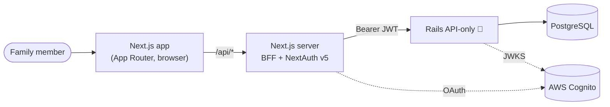
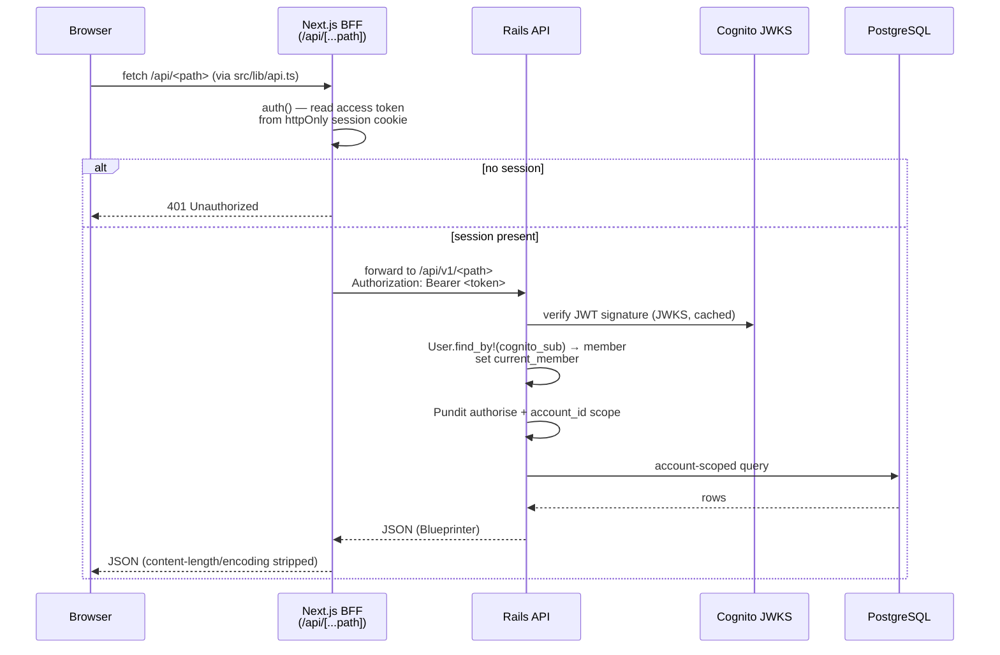
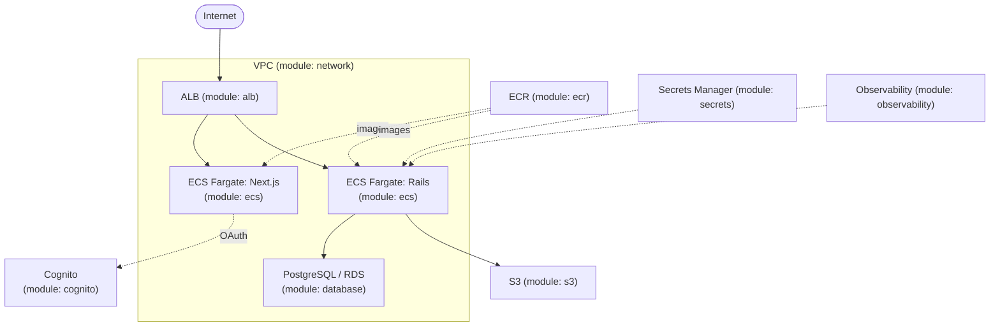

# MyPal — System Architecture

| | |
|---|---|
| **File** | `docs/architecture.md` |
| **Purpose** | The single orientation map for how MyPal is built end to end — components, the request flow, auth, data, and deployment. When you ask "how does a request actually get from the browser to the database?", this is the first place to look. For *why* a decision was made, follow the link to the relevant ADR in `docs/adrs.md`. |
| **Version** | 1.0 |
| **Updated by** | Claude Code |
| **Last updated** | 13/06/2026 15:45 UTC |

**Maintaining this file.** Every edit must: (1) bump the **Version** (patch for wording, minor for a new section or diagram, major for a structural rewrite), (2) update **Last updated** to the current UTC time (`date -u +"%d/%m/%Y %H:%M UTC"` — never guess), (3) set **Updated by**, (4) append a row to the Revision history table at the bottom. The header and the latest revision-history row must always agree. This document **describes the target design** and marks anything not yet built with _(not yet built)_ so the gap is explicit rather than silent. It never contradicts an ADR — if the design changes, change the ADR first (via `/tech_architecture`), then reflect it here.

> **Build-state legend.** ✅ built · 🟡 scaffolded (structure exists, bodies incomplete) · 🔴 _(not yet built)_ — design only. As of v1.0 the frontend is largely built, the Rails backend is design-only, and infrastructure is scaffolded.

---

## 1. System context

MyPal is a UK family digital assistant: one `account` per household, up to six `members`, and a `users` auth identity for each member who can log in (children may have a `members` row with no `users` row — ADR-001). The system has three runtime parts — a **Next.js** frontend that doubles as a **Backend-For-Frontend (BFF)**, a **Ruby on Rails** API-only backend, and **PostgreSQL** — fronted by **AWS Cognito** for identity. Every piece of family data is isolated by `account_id`; cross-account access is impossible by construction (ADR-001).

Authoritative decisions behind this shape: ADR-001 (tenancy), ADR-010 (BFF auth), ADR-015 (Rails), ADR-002 (Pundit authorisation).

---

## 2. Component overview

### Frontend — Next.js App Router ✅
`frontend/src/app/` split into two route groups: `(public)` (sign-in, sign-up, forgot-password) and `(app)` (the authenticated shell with all protected areas — today, life-admin, finance, health, recipes, travel, account, onboarding). `(app)/layout.tsx` is the server-side auth gate. State: **TanStack Query** for server state (one hook file per domain in `src/hooks/`), **Zustand**/`useState` for ephemeral UI state, `react-hook-form` + `zod` for forms. Styling is **Tailwind CSS v4 only** — no third-party UI libraries; shared primitives live in `src/components/ui/`. Governed by `frontend/CLAUDE.md` and `docs/design-system.md`.

### BFF & auth layer — Next.js server ✅ (🟡 Rails target)
NextAuth v5 (`frontend/auth.ts`) runs the Cognito OAuth exchange server-side and stores tokens in an encrypted httpOnly cookie. The browser never calls Rails directly — it calls `/api/<path>` and the proxy forwards to the backend with a Bearer token. Key files: `src/app/api/[...path]/route.ts` (authenticated proxy), `src/app/api/public/[...path]/route.ts` (unauthenticated), `src/app/api/auth/[...nextauth]/` (NextAuth handlers), `middleware.ts` (route enforcement), `src/lib/api.ts` (typed fetcher). See §4 and ADR-010.

> 🔴 **Known drift:** the proxy currently targets `FASTAPI_INTERNAL_URL` (port 8000) and its comments still say "FastAPI". Per ADR-015 / `frontend/CLAUDE.md`, this must be renamed to `RAILS_INTERNAL_URL` when the Rails backend is stood up.

### Backend — Rails API-only 🔴
Design-only as of v1.0: `backend/` contains just `CLAUDE.md` — no `app/`, no Rails scaffold, no Dockerfile. The intended layout (per `backend/CLAUDE.md`): thin controllers under `app/controllers/api/v1/` → fat services in `app/services/` → ActiveRecord models; **Pundit** policies in `app/policies/` (`pundit_user` = `current_member`); **Blueprinter** serializers; JWT verification in `app/lib/cognito_jwt_verifier.rb`. All endpoints versioned under `/api/v1/`. See ADR-015 and §4.

### Data layer — PostgreSQL ✅ (baseline) / 🟡 (full schema)
`db/migrate/` is the **source of truth**; `db/mypal-schema.sql` is a reference document only and must never be edited directly (ADR-015, `backend/CLAUDE.md`). The baseline migration creates the 7 identity tables needed for sign-up/sign-in/onboarding; feature tables are added per-feature. See §5.

### Infrastructure — AWS / Terraform 🟡
`infrastructure/` holds a Terraform layout with reusable `modules/` (network, alb, ecs, ecr, database, s3, cognito, ci, secrets, observability) consumed by `environments/dev` and `environments/prod`. Module bodies are currently stubs (e.g. `modules/ci/main.tf`: "Resources will be defined in Phase 1"). There is no per-area `infrastructure/CLAUDE.md` yet (the root context map references one — a documentation gap). See §6.

---

## 3. Request flow — signed-in API round trip

The canonical path for an authenticated data request. This is the most important diagram in the document.

**Hop by hop:**
1. **Browser → BFF.** Browser code calls `/api/<path>` via the `api<T>()` fetcher (`src/lib/api.ts`). It never holds a Cognito token — that would expose it to XSS (ADR-010).
2. **BFF reads the session.** The proxy calls `auth()` to read the access token from the encrypted httpOnly cookie server-side. No session → `401`.
3. **BFF → Rails.** The proxy rewrites the path to `/api/v1/<path>`, sets `Authorization: Bearer <token>`, strips `cookie`/`host`, and forwards.
4. **Rails verifies the JWT.** `CognitoJwtVerifier.verify` checks the signature against Cognito's cached JWKS; invalid/expired → `401` (`JWT::DecodeError`).
5. **Rails resolves the actor.** `ApplicationController#authenticate_request!` maps the `sub` claim to a `users` row, then to its `members` row, setting `current_member`.
6. **Authorisation + scoping.** The controller calls `authorize record` (Pundit, actor = `current_member`); insufficient permission → `403`. Every query is scoped to `current_member.account_id` (ADR-001, ADR-002).
7. **Response.** Blueprinter serialises the result; the BFF strips recomputed headers (`content-length`, `content-encoding`, `transfer-encoding`) before returning to the browser.

See ADR-010 (BFF), ADR-002 (Pundit), ADR-001 (account scoping).

---

## 4. Auth & authorisation

**Authentication (who you are).** NextAuth v5 handles the browser ↔ Cognito OAuth code exchange on the Next.js server; Cognito access + refresh tokens are encrypted into an httpOnly `__Secure-next-auth.session-token` cookie that JavaScript cannot read (ADR-010). The `(app)/layout.tsx` server component and `middleware.ts` enforce that no unauthenticated request reaches a protected screen or `/api/*` route (except `/api/auth/*` and `/api/public/*`). Rails independently re-verifies every JWT against Cognito's JWKS on each request — it never trusts the BFF blindly.

**Authorisation (what you may do).** Enforced at the **application layer** via Pundit policies, not Postgres RLS (ADR-002). Policies receive `current_member` and check both account membership and per-action permission. Data isolation is the combination of (a) account-scoped queries everywhere and (b) Pundit checks. NF requirement: access is enforced server-side — UI hiding is never the only gate.

**Access-control model (cross-cutting).** The `assigned_to` / `visible_to` field model, the Household Managers Group (HMG) and Family group, and the per-module permission matrix are specified in `_specs/platform--access-control.md` (Draft) and `_specs/terminology.md`. This is **design-only** — not yet implemented or captured as an ADR (see Revision history / proposed ADRs).

---

## 5. Data model & multi-tenancy

**Tenancy (ADR-001).** `accounts` is the top-level tenant. Every member is a `members` row scoped to an account; a `users` row (holding the Cognito `sub`) exists only for members who can log in. Children are first-class members with `user_id = NULL`. Roles live in the `member_roles` lookup (self-referential hierarchy: admin → partner → member → child/grandparent); `members.role_id` points to it, with `members.is_admin` as a convenience flag.

**Plan tiers (ADR-003).** `accounts.plan` is a `VARCHAR` with a CHECK constraint allowing **only** `'solo'` and `'family'` — labelled "Individual" (£2.99/mo) and "Family" (£4.99/mo) in UI; raw values never shown. The `account_types` and `social_logins` tables are deliberately **not** created (ADR-003); Cognito owns OAuth connections.

**Baseline migration** (`db/migrate/20260612000001_create_baseline.rb`) creates 7 tables: `member_roles`, `role_permissions`, `accounts`, `users`, `members`, `account_settings`, `member_settings`. Extensions: `citext` (emails), `pgcrypto` (`gen_random_uuid()`). Feature tables (finance, health, recipes, tasks, journal, etc.) are added by their own migrations.

> 🟡 **Schema reference drift.** `db/mypal-schema.sql` is a v3.0 snapshot describing ~57 tables and **still includes `account_types`, `social_logins`, and a three-value `plan` CHECK** — all superseded by ADR-003. Treat the migrations as authoritative; the SQL file is an aspirational full-model reference pending a refresh. Locale defaults (`GBP`, `Europe/London`, `DD/MM/YYYY`) are seeded in `account_settings`.

For the full table inventory, consult `db/mypal-schema.sql`; this document captures shape and invariants only.

---

## 6. Deployment topology 🟡

Target topology, expressed as Terraform modules under `infrastructure/modules/`, composed per environment in `infrastructure/environments/{dev,prod}`:

Modules and environments are scaffolded but their resource bodies are largely stubs as of v1.0. Frontend ships via `frontend/Dockerfile`; the backend has no Dockerfile yet (🔴). Governed by the intended `infrastructure/CLAUDE.md` (🔴 not yet written).

---

## 7. CI/CD 🔴

Design-only. The intended pipeline is GitHub Actions authenticating to AWS via **OIDC → IAM role** (no long-lived keys), building and pushing images to ECR, and deploying to ECS. There is currently **no `.github/` directory**; the `infrastructure/modules/ci` module is the reserved home for the OIDC role and is still a stub. Local development is supported via `scripts/dev.sh` and `scripts/git-flow.sh`.

---

## 8. Where to go next

| Topic | Source of truth |
|---|---|
| Why a decision was made | `docs/adrs.md` |
| Global rules, stack, vocabulary | `CLAUDE.md` (root) |
| Rails conventions, JWT, Pundit, Blueprinter, RSpec | `backend/CLAUDE.md` |
| Tailwind, BFF contract, NextAuth, ui/ primitives, responsive rules | `frontend/CLAUDE.md` |
| Colour tokens, component catalogue, UX patterns | `docs/design-system.md` |
| Terraform layout, deployment | `infrastructure/README.md` (and `infrastructure/CLAUDE.md` once written) |
| Access-control / visibility / HMG model | `_specs/platform--access-control.md` |
| Product vocabulary (roles, terms, plan labels) | `_specs/terminology.md` |
| Full database table inventory | `db/mypal-schema.sql` (reference) · `db/migrate/` (authoritative) |

---

## Revision history

| Version | Updated by | Last updated (UTC) | Summary |
|---|---|---|---|
| 1.0 | Claude Code | 13/06/2026 15:45 UTC | Initial architecture document. Covers system context, component overview, the signed-in request flow, auth & authorisation, data model & multi-tenancy, deployment topology, and CI/CD. Grounded in the current codebase: notes the FastAPI→Rails proxy drift, the Rails backend as design-only, infra as scaffolded, no CI yet, and the stale `mypal-schema.sql` vs ADR-003. |
