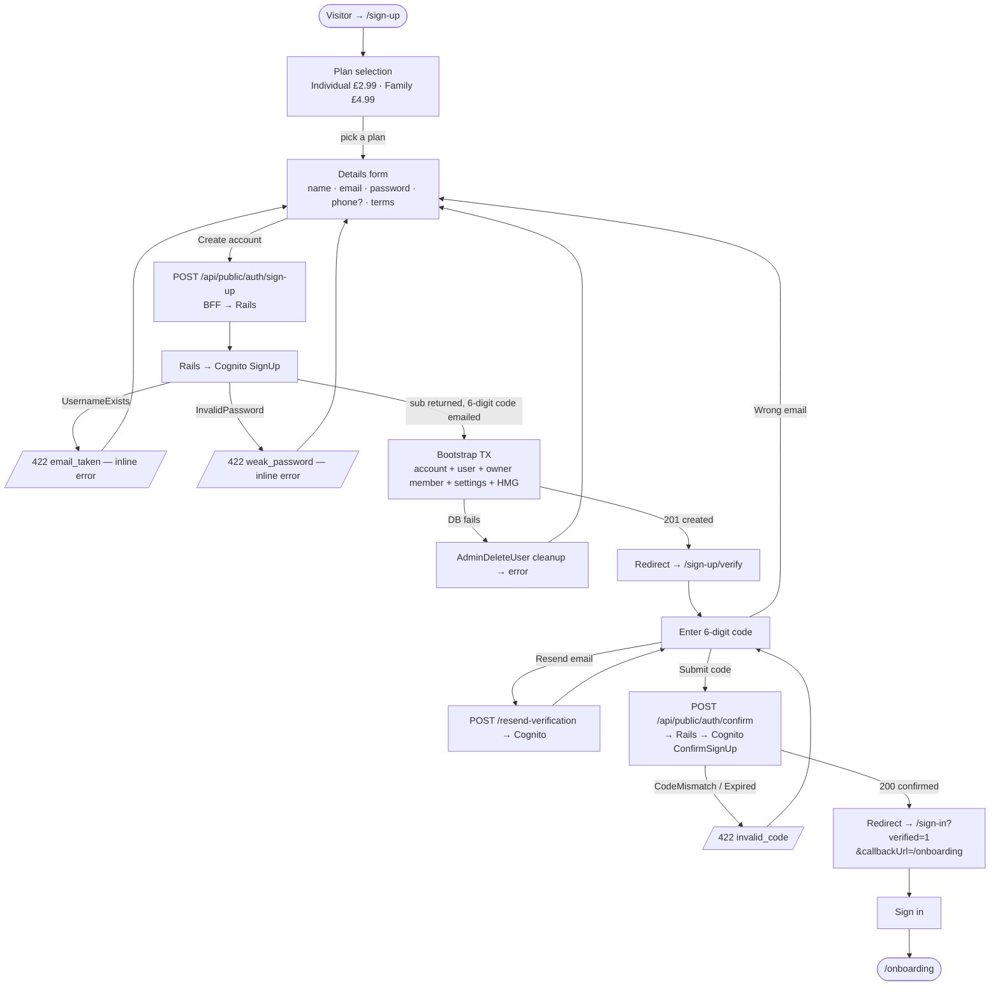

# How Sign Up works

| | |
|---|---|
| **File** | `docs/flows/sign-up.md` |
| **Purpose** | Code-grounded, end-to-end walkthrough of the sign-up flow, for learning the codebase. Describes the code as it is now; the spec lives in `_specs/platform--sign-up.md`, the plan in `_plans/platform--sign-up_tech.md`. |
| **Version** | 1.0 |
| **Updated by** | Claude Code |
| **Last updated** | 15/06/2026 08:23 UTC |
| **Code ref** | `claude/feature/platform--sign-up` @ `e442789` — the code state this walkthrough describes |

**Maintaining this file.** Bump version, restamp `date -u`, set Updated by, append a revision-history row on every edit. Regenerate with `/tech_flow sign up` when the code changes; git holds the version history.

---

## Big picture

Sign-up spans three tiers, and **the browser never talks to Rails or Cognito directly** — every request goes through the Next.js BFF. There are **two** server round-trips — *create account*, then *confirm code* — plus an optional *resend*, and the journey finishes with a normal sign-in that lands the user on `/onboarding`.

```
Browser (forms) → Next.js BFF (public proxy) → Rails API → Cognito + PostgreSQL
```

---

## Flow diagram



```text
  Visitor → /sign-up
        │
        ▼
  ┌────────────────────────────┐
  │ Plan selection             │   Individual £2.99 · Family £4.99
  └──────────────┬─────────────┘
                 │ pick a plan
                 ▼
  ┌────────────────────────────┐ ◀─ terms unticked → submit disabled
  │ Details form               │ ◀───────────────────────────────────┐
  │ name·email·password·phone? │                      inline errors    │
  └──────────────┬─────────────┘                                       │
                 │ Create account                                      │
                 ▼                                                     │
  ┌────────────────────────────┐                                      │
  │ POST /api/public/auth/      │                                     │
  │ sign-up   (BFF → Rails)     │                                     │
  └──────────────┬─────────────┘                                      │
                 ▼                                                     │
  ┌────────────────────────────┐  UsernameExists → 422 email_taken ──┤
  │ Rails → Cognito SignUp      │  InvalidPassword → 422 weak_pwd ────┘
  └──────────────┬─────────────┘
                 │ sub returned + 6-digit code emailed
                 ▼
  ┌────────────────────────────┐  DB fails  ┌──────────────────────────┐
  │ Bootstrap TX: account+user+│───────────▶│ AdminDeleteUser cleanup   │
  │ owner member +settings+HMG │            │ → error → back to form    │
  └──────────────┬─────────────┘            └──────────────────────────┘
                 │ 201 {email}
                 ▼
  ┌────────────────────────────┐  Resend   ┌──────────────────────────┐
  │ /sign-up/verify            │──────────▶│ POST /resend-verification │
  │ enter 6-digit code         │◀──────────│ → Cognito                 │
  └───┬───────────────┬────────┘           └──────────────────────────┘
      │ Wrong email   │ Submit code
      │ (→ form)      ▼
      │   ┌────────────────────────────┐  CodeMismatch/Expired
      │   │ POST /confirm → Cognito    │───────► 422 invalid_code ─► (retry)
      │   │ ConfirmSignUp              │
      │   └──────────────┬─────────────┘
      │                  │ 200 confirmed
      │                  ▼
      │   ┌────────────────────────────┐
      └──▶│ /sign-in?verified=1        │
          │ &callbackUrl=/onboarding   │
          └──────────────┬─────────────┘
                         ▼
                   ┌───────────┐
                   │ /onboarding│
                   └───────────┘
```

---

## Stage-by-stage

### Stage 1 — Plan selection & details form (frontend)
**File:** `frontend/src/app/(public)/sign-up/page.tsx`
- Two-step client component: step 0 = plan cards, step 1 = details form. `chooseType()` (`:127`) sets the plan and advances.
- `PLAN_LABEL = { solo: "Individual", family: "Family" }` (`:59`) ensures "Solo" is never shown to the user.
- Validates with zod + react-hook-form; `pwdScore()` (used at `:108`) from `frontend/src/lib/password-strength.ts` drives the live strength meter.
- `saveDraft()` (`:72`) stashes non-secret fields in `sessionStorage` so "Wrong email? Go back" restores the form.
- `onSubmit()` (`:132`) `fetch("/api/public/auth/sign-up", …)` (`:146`) with body `{ first_name, last_name, email, password, phone?, marketing_opt_in, account_type }`. On success, `router.push("/sign-up/verify?email=…")` (`:178`).

### Stage 2 — BFF public proxy
**File:** `frontend/src/app/api/public/[...path]/route.ts`
- A thin **unauthenticated** proxy. `RAILS = process.env.RAILS_INTERNAL_URL ?? "http://localhost:3001"` (`:7`); forwards to `/api/v1/${path}` (`:11`), stripping `cookie`/`host`/`authorization`. So `/api/public/auth/sign-up` → Rails `/api/v1/auth/sign-up`.

### Stage 3 — Rails routing → controller
**File:** `backend/config/routes.rb` — `post "auth/sign-up" → auth#sign_up` (`:4`), plus `confirm` (`:5`), `resend-verification` (`:6`), `me` (`:7`).
**File:** `backend/app/controllers/api/v1/auth_controller.rb`
- `skip_before_action :authenticate_request!, only: %i[sign_up confirm resend]` (`:4`) — these three are public; `me` stays authenticated.
- `#sign_up` (`:7`): reads `sign_up_params` (`:67`), builds `full_name`, calls `CognitoService.sign_up`, then `AccountBootstrapService.call`, renders `201 { email }`. Rescues map failures via `cognito_error` (`:75`) into `{ detail: { code, detail } }`.

### Stage 4 — Cognito user creation
**File:** `backend/app/services/cognito_service.rb`
- `.sign_up(email:, password:, name:, phone:)` (`:26`) calls Cognito **SignUp** over REST with a computed **SECRET_HASH** (`secret_hash`, `:75`) and the required `name` attribute; returns the user's `sub`. Cognito emails a **6-digit code**.
- Failures raise `CognitoService::Error` (`:14`) carrying `cognito_code` (e.g. `UsernameExistsException` → `email_taken`, `InvalidPasswordException` → `weak_password`).

### Stage 5 — The account-bootstrap transaction
**File:** `backend/app/services/account_bootstrap_service.rb`
- `.call(sub:, …)` (`:10`) runs one `ActiveRecord::Base.transaction` (`:11`) creating: `Account` (plan) → `AccountSetting` → `User` (`cognito_sub`, email, phone, `marketing_opt_in`) → `Member` (`role_id = OWNER_ROLE_ID = 1` (`:8`), `is_admin: true`) → `MemberSetting` → `Group` (type `hmg`) → `GroupMember` (owner as first HMG member — access-control G-01).
- If the transaction raises, `#sign_up` calls `CognitoService.admin_delete` (`:64`) to remove the orphaned Cognito user (best-effort).
- **Models:** `backend/app/models/{account,account_setting,user,member,member_role,member_setting,group,group_member}.rb`. `Member#owner?`/`#is_hmg?` encode role/HMG checks; `Group` disables Rails STI (`type` is a real column).

### Stage 6 — Email verification
**File:** `frontend/src/app/(public)/sign-up/verify/page.tsx`
- `onSubmit()` `fetch("/api/public/auth/confirm", …)` (`:51`) with `{ email, code }` → Rails `auth#confirm` (`:42`) → `CognitoService.confirm` (`:43`) → Cognito **ConfirmSignUp**.
  - Invalid/expired → `422 { detail: { code: "invalid_code" } }`.
  - `200` → `router.push("/sign-in?verified=1&callbackUrl=/onboarding")` (`:75`).
- "Resend email" `fetch("/api/public/auth/resend-verification", …)` (`:83`) → `auth#resend` (`:50`) → `CognitoService.resend` (`:53`) → Cognito **ResendConfirmationCode**.

### Stage 7 — Sign-in completes the journey (`/auth/me`)
- `frontend/auth.ts` (NextAuth Credentials) → `frontend/src/lib/cognito-auth.ts` `initiateUserPasswordAuth()` does Cognito `USER_PASSWORD_AUTH`; tokens go into the **httpOnly session cookie**.
- NextAuth's `jwt` callback fetches `/api/v1/auth/me` → `auth#me` (`:58`). That route is gated by `backend/app/controllers/application_controller.rb#authenticate_request!`, which verifies the JWT via `backend/app/services/cognito_jwt_verifier.rb` (JWKS) and resolves `sub → User → Member`. `me` returns `{ onboarding_complete, account_type }`; a new owner has `onboarding_complete = false`, so the user is routed to `/onboarding`.

---

## What data ends up where

| Table | Columns set at sign-up |
|---|---|
| `accounts` | `plan` (`solo`/`family`) |
| `account_settings` | currency / timezone / date defaults |
| `users` | `cognito_sub`, `email`, `phone?`, `marketing_opt_in` |
| `members` | `role_id = 1` (owner), `is_admin = true`, name, `onboarding_complete = false` |
| `member_settings` | theme / notification / briefing defaults |
| `groups` | `type = 'hmg'` |
| `group_members` | owner ↔ HMG (`added_by` = self) |
| *(Cognito)* | the user identity + password — **never stored in our DB** |

Schema created by `backend/db/migrate/` (baseline + `reseed_member_roles` + `create_groups` + `add_signup_fields`).

---

## Error handling / contract

All auth errors share one shape so the UI can react:
```json
{ "detail": { "code": "email_taken | weak_password | invalid_code | …", "detail": "human message" } }
```
`page.tsx` / `verify/page.tsx` read `detail.code` to place inline field errors; anything unrecognised becomes a generic banner. Mapping lives in `auth_controller.rb#cognito_error` (`:75`).

---

## Security properties
- **Password** is sent once over the BFF→Rails→Cognito path; Cognito hashes it. It is **never** persisted in our DB or logged.
- **JWT lives only in the httpOnly cookie** (set at sign-in) — browser JS can't read it (ADR-010); the BFF attaches it server-side.
- **SECRET_HASH** is required on every Cognito call (confidential app client).
- **Atomic bootstrap** — partial failures roll back, and the orphan Cognito user is deleted (best-effort).

---

## File index

| File | Role in this flow |
|---|---|
| `frontend/src/app/(public)/sign-up/page.tsx` | Plan select + details form; builds the sign-up request; routes to verify |
| `frontend/src/lib/password-strength.ts` | `pwdScore()` strength meter |
| `frontend/src/app/(public)/sign-up/verify/page.tsx` | 6-digit code entry, resend, route to sign-in |
| `frontend/src/app/api/public/[...path]/route.ts` | Unauthenticated BFF proxy → Rails |
| `backend/config/routes.rb` | `/api/v1/auth/*` routes |
| `backend/app/controllers/api/v1/auth_controller.rb` | `sign_up` / `confirm` / `resend` / `me`; error envelope |
| `backend/app/services/cognito_service.rb` | Cognito SignUp/Confirm/Resend/AdminDelete + SECRET_HASH |
| `backend/app/services/account_bootstrap_service.rb` | One-transaction account + owner + HMG creation |
| `backend/app/models/*.rb` | `Account`, `User`, `Member`, `Group`, `GroupMember`, settings, `MemberRole` |
| `backend/app/controllers/application_controller.rb` + `app/services/cognito_jwt_verifier.rb` | JWT verify + `current_member` (powers `/auth/me`) |
| `frontend/auth.ts` + `frontend/src/lib/cognito-auth.ts` | Sign-in (completes the journey to onboarding) |

---

## Gaps / drift
- **6-digit code, not a link.** The spec (`platform--sign-up.md` §9) describes a "verification link"; the implemented flow uses a **code** (`ConfirmSignUp`). Decided in the plan; the code is the source of truth.
- **SES sender not wired.** Cognito uses its default sandbox sender; the branded `YourDigitalPal@…` SES identity is a pre-prod task — in the SES sandbox only verified recipient addresses receive the email.
- **`AdminDeleteUser` rollback needs IAM creds.** In local dev (no AWS creds in `backend/.env`) it logs and no-ops; the DB transaction still rolls back cleanly.
- **`/auth/me` uses the access token** (`sub` only); profile/identity is sourced from our DB, not the ID token (which the credentials flow discards).

---

## Revision history
| Version | Updated by | Last updated (UTC) | Summary |
|---|---|---|---|
| 1.0 | Claude Code | 15/06/2026 08:23 UTC | Initial walkthrough. Generated against `claude/feature/platform--sign-up` @ `e442789`. |
