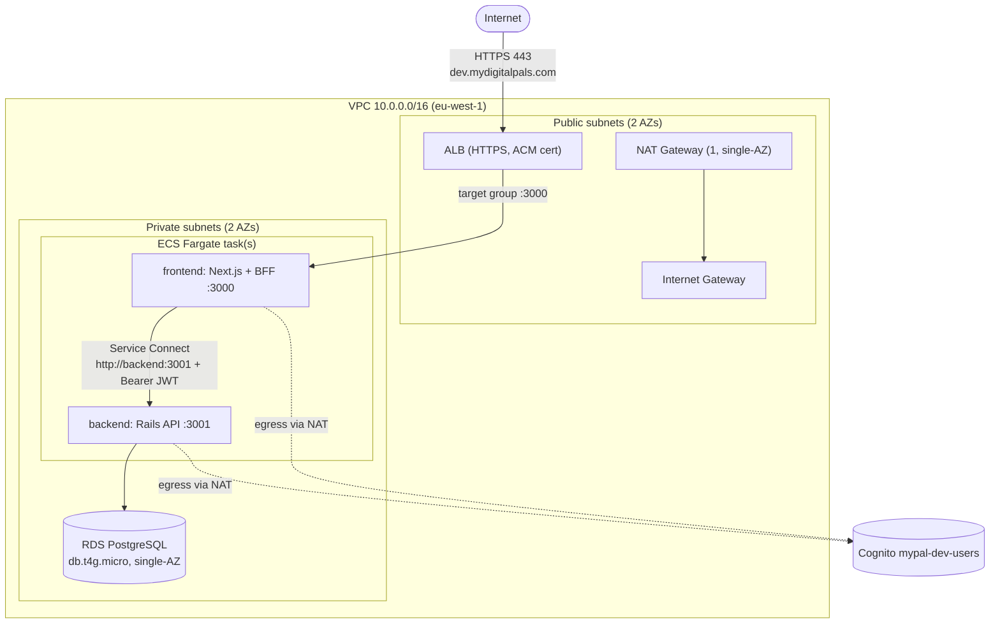

# MyPal — Deployment Architecture (AWS)

| | |
|---|---|
| **File** | `infrastructure/deployment-architecture.md` |
| **Purpose** | The concrete AWS deployment design the Terraform implements — topology, networking, resources, env/secrets, cost, and the spin-up/teardown runbook. The *decisions* behind it live in `docs/adrs.md` (ADR-016); this file is the buildable detail. |
| **Status** | Draft — agreed, pre-implementation (no Terraform written yet) |
| **Version** | 0.1 |
| **Last updated** | 14/06/2026 16:18 UTC |
| **Region** | `eu-west-1` |
| **AWS account** | `382888552064` |

---

## 1. Goal & usage pattern

Stand up a **production-shaped** environment on AWS to test the app end-to-end, then **tear it down** after each session. Expected usage: **~2 hours × ~8 times/month (~16 running hours/month)**. Because the costly resources are destroyed between sessions, they bill only while running (~**$2–3/month** all-in).

This drives two design choices:
- **Topology = Option C** (ALB-public / app + data tiers private + NAT) — the real production pattern, chosen for fidelity and learning value (ADR-016). Cost penalty of the NAT Gateway is negligible under the ephemeral model.
- **Terraform split into a persistent *base* and an ephemeral *stack*** so spin-up/teardown is fast and cheap (see §6).

---

## 2. Topology (Option C)

> Clarification on "front end public, back end private": the **ALB** is the only public-facing component. **Both** app tasks (frontend and backend) run in **private** subnets — the frontend is "public-facing" *through the ALB*, not by sitting in a public subnet. RDS is private too. This is the standard 3-tier ECS layout.



**Two ECS services** (separate task definitions) connected by **ECS Service Connect**:
- Browser → **ALB (HTTPS)** → **frontend** service (port 3000).
- frontend BFF → **backend** via Service Connect DNS `http://backend:3001` (so `RAILS_INTERNAL_URL` changes from `localhost` to `http://backend:3001`).
- backend → **RDS** (private).
- Both tasks reach **Cognito** (sign-in / JWKS) outbound via the **NAT Gateway**.

**Security groups (isolation is enforced here, not by subnets):**
| SG | Inbound allowed from |
|---|---|
| `alb-sg` | `0.0.0.0/0` on 443 |
| `frontend-sg` | `alb-sg` on 3000 |
| `backend-sg` | `frontend-sg` on 3001 |
| `rds-sg` | `backend-sg` on 5432 |

---

## 3. Resource inventory

| Layer | Resource | Spec (min) |
|---|---|---|
| Network | VPC | `10.0.0.0/16` |
| | Public subnets ×2 | one per AZ |
| | Private subnets ×2 | one per AZ |
| | Internet Gateway | 1 |
| | NAT Gateway | **1** (single-AZ to save cost; not HA) |
| | Route tables | public → IGW; private → NAT |
| Ingress | ALB | public, HTTPS:443 listener, ACM cert |
| | Target group | → frontend :3000, health check `/` |
| Compute | ECS cluster | Fargate |
| | frontend service | 1 task, 0.25 vCPU / 0.5 GB |
| | backend service | 1 task, 0.25 vCPU / 0.5 GB |
| | Service Connect namespace | `mypal.local` (Cloud Map) |
| Data | RDS PostgreSQL | `db.t4g.micro`, single-AZ, 20 GB gp3, **not publicly accessible** |
| Registry | ECR repos | `mypal-frontend`, `mypal-backend` |
| Secrets | Secrets Manager | DB URL, `SECRET_KEY_BASE`, `AUTH_SECRET`, reuse `mypal-dev/cognito/web-bff` |
| Identity | Cognito | **reuse** `mypal-dev-users` (`eu-west-1_nCIdduU2J`) |
| DNS/TLS | Route 53 | zone `mydigitalpals.com` (`Z09913911EEIU3SSW13XE`) |
| | ACM cert | wildcard `*.mydigitalpals.com` (+ apex) |
| Logs | CloudWatch Logs | one log group per container |
| CI/CD *(later)* | GitHub Actions OIDC role | push to ECR, deploy ECS |

---

## 4. Environments & DNS

| Environment | Hostname | When |
|---|---|---|
| Local | `localhost:3000` (docker compose) | always |
| **Dev (deployed)** | **`dev.mydigitalpals.com`** | **build now** |
| UAT / staging | `uat.mydigitalpals.com` | later |
| Production | `mydigitalpals.com` (+ `www` redirect) | later |

- A single **wildcard ACM cert** `*.mydigitalpals.com` covers all environments (validated once via Route 53).
- Each environment is an independent stack (own ALB/ECS/RDS). Build **`dev` only** for now.
- **Cognito:** reuse `mypal-dev-users` for dev/uat now; provision a separate `mypal-prod-users` before go-live (noted in ADR-016 consequences).

---

## 5. Configuration & secrets (per container)

Injected into the ECS task definitions from **Secrets Manager / SSM** — never `.env` files.

**frontend (Next.js / BFF):**
| Var | Value |
|---|---|
| `AUTH_URL` | `https://dev.mydigitalpals.com` |
| `AUTH_SECRET` | secret |
| `AUTH_TRUST_HOST` | `true` |
| `RAILS_INTERNAL_URL` | `http://backend:3001` (Service Connect) |
| `COGNITO_ISSUER` / `COGNITO_CLIENT_ID` / `COGNITO_CLIENT_SECRET` | from `mypal-dev/cognito/web-bff` |

**backend (Rails):**
| Var | Value |
|---|---|
| `RAILS_ENV` | `production` |
| `DATABASE_URL` | RDS endpoint, `?sslmode=require` (secret) |
| `SECRET_KEY_BASE` | secret |
| `AWS_REGION` | `eu-west-1` |
| `COGNITO_USER_POOL_ID` | `eu-west-1_nCIdduU2J` |
| `COGNITO_CLIENT_ID` / `COGNITO_CLIENT_SECRET` | from `mypal-dev/cognito/web-bff` |
| `ALLOWED_ORIGINS` | `https://dev.mydigitalpals.com` |
| `RAILS_LOG_TO_STDOUT` | `1` |

> The backend task role needs `secretsmanager:GetSecretValue` on the relevant secrets, and (for the AdminDeleteUser rollback) `cognito-idp:AdminDeleteUser` on the pool.

---

## 6. Terraform layout — base vs ephemeral

Split so the per-session cycle is fast and only the hourly-billed resources churn.

| Stack | Contains | Lifecycle | ~Cost |
|---|---|---|---|
| **base** (persistent) | VPC, subnets, IGW, route tables, **ACM wildcard cert**, ECR repos + images, Secrets Manager, Route 53 records that don't depend on the ALB | created once, left up | ~cents/month |
| **ephemeral** (per session) | **NAT Gateway**, ALB + listener + target group, ECS cluster/services/tasks, **RDS**, the `dev.mydigitalpals.com` ALIAS → ALB | `apply` at start, `destroy` at end | billed only while up |

> NAT, ALB, and RDS are the per-hour costs, so they live in the **ephemeral** stack. The ACM cert lives in **base** (DNS validation takes minutes — don't recreate it each session).

Likely maps onto: `infrastructure/environments/dev-base/` and `infrastructure/environments/dev/` (ephemeral), both composing reusable `modules/`.

---

## 7. Cost estimate (~16 running hours/month)

| Item | Per running hour | Monthly (×16h) |
|---|---|---|
| NAT Gateway | ~$0.045 + data | ~$0.72 |
| ALB | ~$0.025 | ~$0.40 |
| Fargate (2 × 0.25 vCPU / 0.5 GB) | ~$0.025 | ~$0.40 |
| RDS `db.t4g.micro` | ~$0.016 | ~$0.26 |
| Base (cert, ECR, secrets, zone) | — | ~$1–2 |
| **Total** | | **~$3–4/month** |

(Storage/log/data transfer are negligible at this scale. Numbers are eu-west-1 list price, approximate.)

---

## 8. Spin-up / teardown runbook (target)

```bash
# One-time: provision the persistent base (VPC, cert, ECR, secrets)
cd infrastructure/environments/dev-base && terraform init && terraform apply

# Per session — start (~a few minutes; RDS is the slowest part)
cd infrastructure/environments/dev && terraform init && terraform apply
#   then run migrations once (or via container entrypoint):
#   aws ecs run-task ... bin/rails db:prepare

# Test at https://dev.mydigitalpals.com ...

# Per session — teardown (stops all hourly charges)
terraform destroy
```

Images are rebuilt/pushed to ECR (base) only when code changes, not every session.

---

## 9. Open items / decisions still to make

- [ ] **DB persistence:** RDS is destroyed each session (data lost — acceptable for testing). If you later want data to persist between sessions, move RDS into `base` and `stop` it instead (note: stopped RDS still bills storage and auto-starts after 7 days).
- [ ] **NAT vs VPC endpoints:** a single NAT is simplest. To cut NAT data cost, add VPC interface endpoints for ECR/Secrets/CloudWatch/S3 (Cognito still needs NAT — no clean PrivateLink). Learning exercise; not needed for first deploy.
- [ ] **Migrations:** run via a one-off `ecs run-task` vs the Rails container entrypoint (`db:prepare`). Entrypoint is simplest for a single task.
- [ ] **Frontend production Docker image** must be verified (`npm run build` + `next start`, ideally `output: 'standalone'`).
- [ ] **CI/CD** (GitHub OIDC → ECR/ECS) — out of scope for the first manual deploy.
- [ ] **Separate prod Cognito pool** before any production environment.

---

## 10. References

- Decision record: `docs/adrs.md` → ADR-016
- App/system architecture: `docs/architecture.md` (§6 Deployment topology)
- Terraform conventions: `infrastructure/CLAUDE.md`
- Prod env-var changes rationale: this file §5
